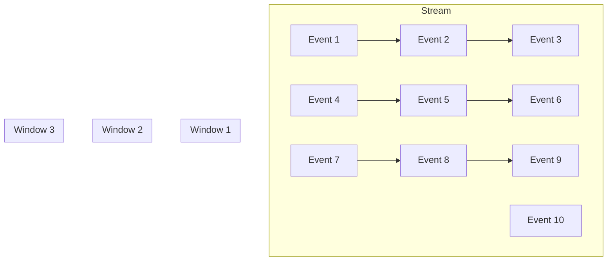
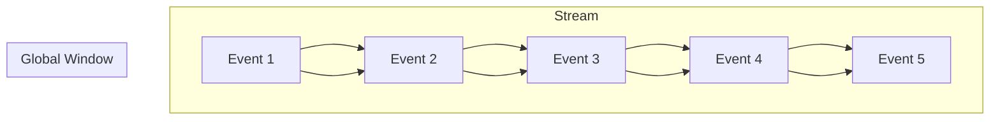
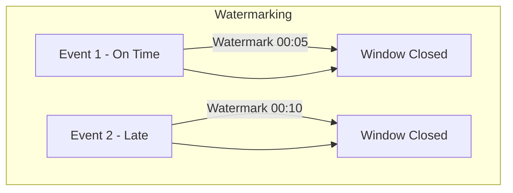

```mermaid
gantt
    dateFormat  HH:mm
    axisFormat  %H:%M
    section Tumbling Window
    Window 1    :a1, 00:00, 00:05
    Window 2    :a2, 00:05, 00:10
    Window 3    :a3, 00:10, 00:15
    Window 4    :a4, 00:15, 00:20
```

```mermaid
gantt
    dateFormat  HH:mm
    axisFormat  %H:%M
    section Sliding Window
    Window 1    :a1, 00:00, 00:05
    Window 2    :a2, 00:01, 00:06
    Window 3    :a3, 00:02, 00:07
    Window 4    :a4, 00:03, 00:08
```

```mermaid
gantt
    dateFormat  HH:mm
    axisFormat  %H:%M
    section Session Window
    Session 1   :a1, 00:00, 00:07
    Session 2   :a2, 00:10, 00:15
    Session 3   :a3, 00:18, 00:23
```

```mermaid
gantt
    dateFormat  HH:mm
    axisFormat  %H:%M
    section Hopping Window
    Window 1    :a1, 00:00, 00:10
    Window 2    :a2, 00:05, 00:15
    Window 3    :a3, 00:10, 00:20
    Window 4    :a4, 00:15, 00:25
```

```mermaid
gantt
    dateFormat  HH:mm
    axisFormat  %H:%M
    section Session Window with Gaps
    Session 1   :a1, 00:00, 00:07
    Gap         :done, 00:07, 00:10
    Session 2   :a2, 00:10, 00:17
```

# Streaming Design

This document contains some thoughts on how to implement streaming semantics for bpfquery.

To start with, going to write out some questions I have with my current answers to them. Currently writing this with ["What is streaming sql?" by Arroyo et al. in mind](https://www.arroyo.dev/blog/what-is-streaming-sql). 

> How parallel is the execution of an bpf program (and also bpftrace)?

I am actually not sure at this point. [Apparently it happens in parallel sequentially in the cpu of the program that triggers the probes](https://stackoverflow.com/questions/76693000/ebpf-program-execution-context). The more you know! So bpf program execution is colocated with the program that triggers the probe, and the probes are triggered in parallel across the cpu. bpftrace itself runs on a single cpu, managing the loading of the bpf programs and processing of the results. 

> What counts as a relation? 

A relation is anything that can be queried. Right now, the only relations in bpfquery are the streams of events coming from bpftrace probes. These are never ending rows of data, unbounded for now. Maybe someday it will be possible to put a timer on it, but by default, they go forever. Another possible type of relation the standard sql table of data. Right now, that doesn't exist at all in bpfquery. It would be nice someday but isn't needed right now. Right now, the focus is on probes as streaming data.

> How does the number and type of relations effect the results of the query? 

* Zero relations (i.e. no `from` clause) - the projections in the query are evaluated and returned.
* One relation - depends on whether it is a stream or table. 
** One stream - the results are continuously evaluated and returned, unbounded and never ending query. 
** One table - the results are evaluated and returned immediately, the query is done.
* Multiple relations - if there's at least one stream, then it's a streaming join. Otherwise, just standard joins across static tables. 

> What is the difference between a streaming join and a standard join?

Standard joins have a static amount of data to work with that is knowable at query time. Streaming joins do not have this, it's unbounded. A standard join you want to know the answer to as soon as possible, a streaming join is more like you want to know the answer regularly at various intervals. Taking a note from Arroyo and the Dataflow model from Google, this means that you introduce watermarks, which are points in time where you know all the data you want to know for a streaming join and can go ahead and produce a result. This watermark can move forward as time goes on, but it's a way to know when you can produce a result.

> What is an aggregated query?

[A conversation with chapgpt influnced this and following secitons](https://chatgpt.com/share/9bd39e60-d24f-446e-bd5e-1d2194e860bf)

An aggregated query is a query that has an aggregate function in it. This is a function that takes a set of rows and produces a single value. Examples of this are `sum`, `avg`, `count`, `min`, `max`. If a query does not have an aggregate function in it, then it doesn't really matter whether it is a streaming query or not, it can be evaluated as soon as the data is available. The streaming queries will just return all the rows as they come in, applying where clauses and the like, while a standard query will just return the rows from the bounded set of data. We only have to start talking about watermarks and the like when we have an aggregate function in a streaming query.


> What are the different types of windows that can be used in an aggregated streaming query?

Streaming queries are unbounded, meaning the rows can come in forever. An aggregation in theory requires have a bounded set of rows to work with. This is a contradiction! We cannot not know all the data before doing the aggregation, but also we want to know the results of the aggregation at some point. The concept of windows in aggregated streaming queries are how we resolve this tension. Windows allows one to define sets of rows that will be aggregated to together. There are  different types of windows that can be used in a streaming query, each varying in a way that is useful for different types of questions. But, always remember, the goal is to provide the set of rows to the aggregation function to the question we want answered. 

### 1. **Tumbling Window**
**Explanation**: A tumbling window is a fixed-size, non-overlapping window that groups events into distinct time intervals.

**Example Query**: Count the number of events in each 5-minute interval.

**Example Systems**: Apache Kafka Streams, Apache Flink

**SQL Query**:
```sql
SELECT 
    TUMBLE_START(event_time, INTERVAL '5' MINUTE) AS window_start,
    COUNT(*) AS event_count
FROM 
    events
GROUP BY 
    TUMBLE(event_time, INTERVAL '5' MINUTE);
```

**Mermaid.js Diagram**:


---

### 2. **Sliding Window**
**Explanation**: A sliding window is a fixed-size window that overlaps, meaning an event can belong to multiple windows as the window slides over the data.

**Example Query**: Calculate the moving average of user activity every 5 minutes, sliding every 1 minute.

**Example Systems**: Apache Spark Streaming, Apache Beam

**SQL Query**:
```sql
SELECT 
    HOP_START(event_time, INTERVAL '5' MINUTE, INTERVAL '1' MINUTE) AS window_start,
    AVG(activity) AS avg_activity
FROM 
    user_activity
GROUP BY 
    HOP(event_time, INTERVAL '5' MINUTE, INTERVAL '1' MINUTE);
```

**Mermaid.js Diagram**:


---

### 3. **Session Window**
**Explanation**: A session window is defined by periods of activity followed by a gap of inactivity. The window closes when no new events arrive for a specified duration.

**Example Query**: Group user activity into sessions where a session ends if there is no activity for 10 minutes.

**Example Systems**: Apache Flink, Google Cloud Dataflow (Apache Beam)

**SQL Query**:
```sql
SELECT 
    SESSION_START(event_time, INTERVAL '10' MINUTE) AS session_start,
    SESSION_END(event_time, INTERVAL '10' MINUTE) AS session_end,
    COUNT(*) AS event_count
FROM 
    user_activity
GROUP BY 
    SESSION(event_time, INTERVAL '10' MINUTE);
```

**Mermaid.js Diagram**:


---

### 4. **Hopping Window**
**Explanation**: A hopping window is similar to a sliding window but has a fixed-size window that advances by a specified interval (hop). Windows can overlap.

**Example Query**: Calculate the sum of transactions in a 10-minute window that hops every 5 minutes.

**Example Systems**: Apache Kafka Streams, Apache Flink

**SQL Query**:
```sql
SELECT 
    HOP_START(transaction_time, INTERVAL '10' MINUTE, INTERVAL '5' MINUTE) AS window_start,
    SUM(amount) AS total_amount
FROM 
    transactions
GROUP BY 
    HOP(transaction_time, INTERVAL '10' MINUTE, INTERVAL '5' MINUTE);
```

**Mermaid.js Diagram**:


---

### 5. **Count Window (Count-based Window)**
**Explanation**: A count window groups events based on a fixed number of events instead of time.

**Example Query**: Batch process every 100 events.

**Example Systems**: Apache Storm, Apache Kafka Streams

**SQL Query**:
```sql
SELECT 
    COUNT(*) AS event_count,
    SUM(value) AS total_value
FROM 
    events
GROUP BY 
    FLOOR((ROW_NUMBER() OVER (ORDER BY event_time) - 1) / 100);
```

**Mermaid.js Diagram**:


---

### 6. **Global Window**
**Explanation**: A global window includes all events in the stream. It aggregates over the entire data stream without a fixed size or duration.

**Example Query**: Calculate the total number of users since the application started.

**Example Systems**: Apache Beam, Apache Flink

**SQL Query**:
```sql
SELECT 
    COUNT(*) AS total_users
FROM 
    user_events;
```

**Mermaid.js Diagram**:


---

### 7. **Watermarking Windows**
**Explanation**: Watermarking handles out-of-order events by generating timestamps (watermarks) that signal when a certain point in time has been reached, allowing windows to close and results to emit even if some late events arrive.

**Example Query**: Handle late-arriving events in a 5-minute window with a watermark allowing a 1-minute delay.

**Example Systems**: Apache Flink, Google Cloud Dataflow (Apache Beam)

**SQL Query**:
```sql
SELECT 
    TUMBLE_START(event_time, INTERVAL '5' MINUTE) AS window_start,
    COUNT(*) AS event_count
FROM 
    events
WHERE 
    event_time <= WATERMARK(event_time) + INTERVAL '1' MINUTE
GROUP BY 
    TUMBLE(event_time, INTERVAL '5' MINUTE);
```

**Mermaid.js Diagram**:


---

### 8. **Session Windows with Gaps**
**Explanation**: This advanced session window allows varying gap logic to define when the session window closes, providing flexibility based on specific conditions.

**Example Query**: Group user activity into sessions, but vary the session timeout based on user activity patterns.

**Example Systems**: Apache Flink, Google Cloud Dataflow (Apache Beam)

**SQL Query**:
```sql
SELECT 
    SESSION_START(event_time, INTERVAL '10' MINUTE) AS session_start,
    SESSION_END(event_time, INTERVAL '10' MINUTE) AS session_end,
    COUNT(*) AS event_count
FROM 
    user_activity
GROUP BY 
    SESSION(event_time, INTERVAL '10' MINUTE, INTERVAL '5' MINUTE);
```

**Mermaid.js Diagram**:


---

This comprehensive output includes everything you need to understand each window type, including explanations, example queries, SQL